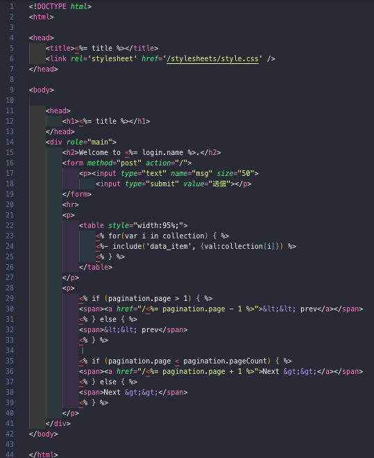
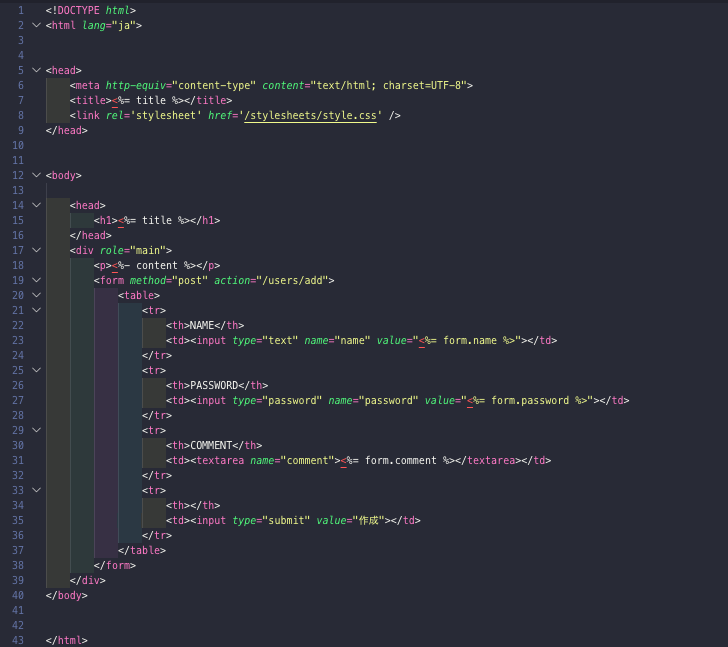

## Node.js 超入門

### ECL 輪読発表
#### 蒔田圭輔


---

## OUTLINE

- ### 7-1 DB版ミニ伝言板
- ### 7-2 Markdownデータ管理ツール

---

## 7-1 DB版ミニ伝言板

+++

### 本節での目的
6章までで作った伝言板アプリに対して
DB連携をしてアプリケーションを作ろう

+++

### Express Generatorでひな形作成

```shell
$ express -e mini_board_2
```

+++

### 必要なパッケージのインストール

```shell
$ npm install --save express-sessions
$ npm install --save express-validator
$ npm install --save mysql
$ npm install --save knex
$ npm install --save bookshelf
```

+++

### テーブルの定義をする(1)

#### ユーザの情報を管理するテーブル user

- id: INT
  -  PRIMARY_KEY, AUTO_INC : 識別用番号 
- name : VARCHAR(255)
  - ユーザの名前
- password: VARCHAR(255)
  - ユーザのパスワード
- comment: VARCHAR(255)
  - コメント


+++

#### SQL文にすると

```sql
CREATE TABLE `users` (
        `id`        INTEGER NOT NULL PRIMARY KEY AUTOINCREMENT UNIQUE,
        `name`        TEXT NOT NULL,
        `password`        TEXT NOT NULL,
        `comment`        TEXT
);
```

+++

### テーブルの定義をする(2)

#### 掲示板のメッセージを管理するテーブル messages

- id: INT
  -  PRIMARY_KEY, AUTO_INC : 識別用番号 
- user_id: INT
  -  投稿したユーザの識別番号
- message : TEXT
  - 投稿内容
- created_at: DATETIME
  - 投稿日時
- updated_at: DATETIME
  - 更新日時

+++

```sql
CREATE TABLE `messages` (
        `id`        INTEGER NOT NULL PRIMARY KEY AUTOINCREMENT UNIQUE,
        `user_id`        INTEGER NOT NULL,
        `message`        TEXT NOT NULL,
        `created_at`        REAL,
        `updated_at`        REAL
);
```

+++

### トップページをつくる


index.ejs

+++



+++

#### 投稿されるメッセージを出力
```ejs
<% for(var i in collection) { %>
<%- include('data_item', {val:collection[i]}) %>
<% } %>
```

+++?code=src/7-04.ejs&size=contain

#### データ構造の定義　data_item.ejs

+++

ユーザのホームページを作成する

home.ejs



+++?image=img/7-07.png&size=contain

ユーザ新規作成ページの作成

add.ejs


+++?code=src/7-08.css

### スタイルシートの用意

+++
### 変数

#### 変数の宣言

``` javascript
var hoge0;

hoge1 = 1;

let hoge2;

const hoge3;
```
- 代入するなら 変数 = 値 |
- 変数の値取得は 代入先 = 変数名 |

+++

### 計算をする
- 加算: +
- 減算: -
- 乗算: *
- 除算: /

+++ ?code=a3.html

+++ ?code=a3.js

+++


+++

### まとめ

- JavaScriptはhtml上で動作するスクリプト言語
- htmlに直書きするか、jsファイルを作成してhtmlで読み込む |
- 値を保存し、管理する"変数"
- 主要なデータ型3つは、number, string, boolean |
- 変数計算をして、その値をhtml上に出力することができる

---

## 2-1 ソースコードの基本

+++

#### 第一回にて実行したソースを分解してみる

``` js
require('http').createServer(
    (rq,rs)=>{rs.end('Hello Node.js!');}).listen(3000);
```

+++?code=2-01.js

#### こんなかんじにできる

+++

### Nodeで実行してみる

``` shell
$ node app.js
```

+++

#### localhost3000番にアクセス


+++

### :3000って?

- ポート番号と言い、サーバへアクセスする上、同一サーバ上でサービスの選択をする事ができる |

### どうして3000番なの?

- nodeでは標準的に3000番を利用するようになっている |

+++?code=2-01.js

@[1](httpモジュールを取得して代入)
@[3](サーバオブジェクトの生成)
@[4,5,6](クライアントからアクセスされたときの動作を無名関数で定義)
@[8](ポート番号3000番によるアクセスを待機)

+++

### アクセスに対してhtmlを返すことを考える

いままではただのテキストだったのを、HTMLの出力にしたい

+++?code=2-02.js

+++


+++

### そもそも...
- HTTP通信でサーバからhtmlを取得している |
- HTTP通信をする上で、現状だと不足してるものが... |
- ヒント: 先程つくったhtml部はレスポンスボディ部になる

+++

### ヘッダをつける必要がある!!

+++?code=2-03.js

@[5](ヘッダを設定する)
@[5](送信するコンテンツはhtmlであることを定義)

+++


+++?code=2-03.js
### ヘッダ情報の他に追加したもの

@[6](使用している言語が日本語で有ることを定義)
@[7](使用する文字コードがUTF-8であることを定義)

+++

### console.logについて

- console.logはいわゆる標準出力でクライアントには最初は見えない |
- デバッグなどで動作確認するために利用しよう |

+++ 

### まとめ

- nodeでサーバオブジェクトを作るときに実行する文は
    - require('http'); |
- サーバを、クライアントからの3030番アクセス待ちにする為の関数は
    -  server.listen(3030); |
- レスポンスを返す際にHTML出力をしたい場合、response.endの他の手段は
    - response.write |

--- 

## 2-2 HTMLファイルを使おう 

+++

### さっきまでは

- jsソース内に書いてあったHTMLを返していた
- js内で書くのってめんどう...
- htmlを別ファイルで読み込めるようにしよう |

+++?code=2-04.html

### 今回のhtmlソース


+++?code=2-05.js

### 別ファイルを読み込んでそれを返すプログラム

@[2](ファイルを扱うFileSystemオブジェクトの作成)
@[6](読み込みたいファイルと文字コードを指定)
@[9](dataの中に読み込んだ情報が入っている)


+++ 

### 今度は...
#### 関数に分解したい

- 整理しやすい |
- 再利用性があがるetc... |

+++?code=2-06.js

@[4](後述のgetFromClient関数でレスポンス処理を分解している)
@[11,12,13,14,15,16,17,18,19,20,21](切り離して記述した処理)
@[12](関数の定義は funtion でおこなう)

+++?code=2-07.js
コールバック関数単位で分解してみる

@[3,4](分解した際に渡せなくなる値用に宣言)
@[13,14,15,16,17,18](createServerのコールバック関数部)
@[22,23,24,25,26](readfileのコールバック関数部)

+++

### 非同期処理について

#### ざっくり
- 順番に処理をしていく: 同期処理 |
- とにかく命令を優先(処理の進捗は二の次) 非同期処理 |

- keyword: async, await

+++

### jsでできる他のこと
#### テキストの操作 |

+++?code=2-08.html

### ちょっと修正

+++?code=2-09.js

@[17,18,19](読み込んだdata, htmlファイルから、対応する文字列を置換する)
@[18,19](/ hoge /g は、正規表現)


+++ 

### まとめ
- ファイルを扱うときに必要なオブジェクト
    - require('fs'); |
- 関数を定義する際に最初に書くモノ
    - function |
- 同期処理と非同期処理、命令を出すこと優先なのは
    - 非同期処理 |

+++

### まとめ(つづき)
- テキスト(文字列)の置換をするときに必要な関数
    - replace(); |
- 文字列のパターンマッチングにつかう/hoge/g は?
    - 正規表現 |
